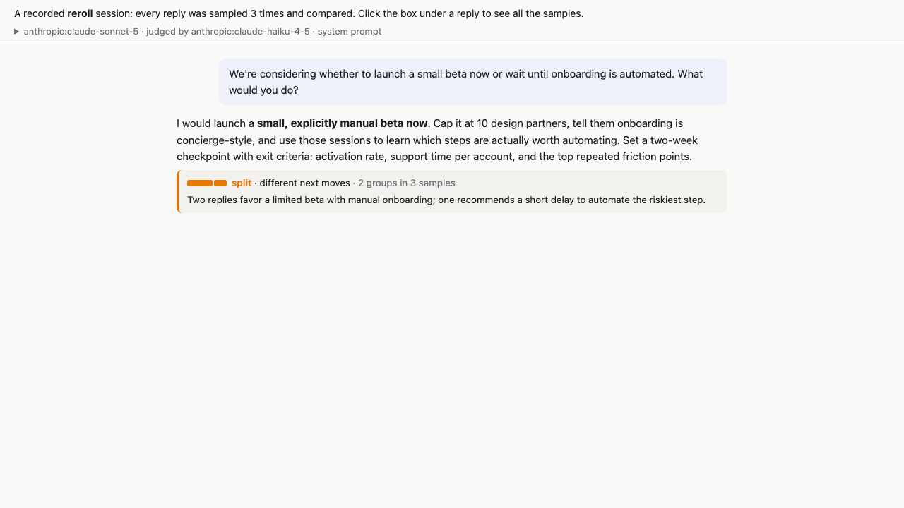
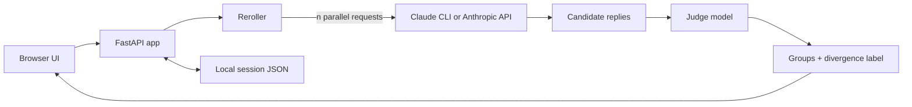

# reroll

See the range of replies an AI could have given—not just the one you happened to get.



[Open the sanitized example conversation](examples/reroll-demo.html) to explore all of its samples in the read-only export view.

reroll is a local web chat that samples every reply _n_ times. A judge model compares the samples, groups replies that take the same conversational route, and describes the most important difference:

- **consistent**: the replies are interchangeable
- **different next moves**: they read you similarly but take compatible directions
- **read you differently**: they interpret an ambiguous message in different ways
- **contradicting each other**: they make incompatible claims

The chat shows one randomly selected sample, as a normal chat would. Its label reveals the wider distribution and flags when the displayed answer belongs to a minority group.

## Architecture



`static/index.html` contains the single-page UI, `web.py` exposes the local API, and `core.py` runs sampling, judging, and session storage. Exports embed a session into the same UI as a single-file, read-only HTML page.

## Run

reroll supports two backends:

- **Claude CLI** (default) runs `claude -p` locally and is convenient for interactive experimentation with an installed, authenticated Claude CLI.
- **Anthropic API** (`--backend api`) is intended for programmatic use through Pydantic AI and requires `ANTHROPIC_API_KEY` in `.env` or the environment.

Each turn makes _n_ model requests plus one judge request, so choose the sample count and model with your provider's usage limits and costs in mind.

Start the default CLI backend:

```bash
uv run main.py --system prompts/demartini.md
```

Or start the API backend:

```bash
uv run main.py --backend api --system prompts/demartini.md
```

The app opens at http://127.0.0.1:8765. `--system` only prefills the prompt for new sessions. Options include `--model` (default `anthropic:claude-opus-5`), `--judge` (default `anthropic:claude-haiku-4-5`), `-n` (default 5), `--concurrency` (default 2), `--effort`, and `--port`.

## Using it

- Click a reply's label to compare every sample side by side and see how the judge grouped them.
- **Continue with this** switches the latest turn to another sample.
- **Edit** rewrites and resamples your latest message while preserving earlier versions and verdicts.
- **Resample** reruns the latest turn unchanged.
- The system prompt in the top bar can be edited mid-session and applies to the next message.
- **Export** downloads a single-file, read-only HTML conversation. Review exports before sharing because they contain the conversation and system prompt.

Sessions are stored in `sessions/` with attempts, samples, judge output, and the system prompt used for each attempt. Errors are logged to `reroll.log`.

## Limitations

- **Variance does not measure correctness.** The labels describe how this model's sampled replies differ; they do not verify facts or rank which route is best.
- **Consensus can still be wrong.** Samples share a model, prompt, and context, so they can repeat the same hallucination, bias, or faulty assumption.
- **Small sample counts are exploratory.** A split such as 4–1 can change on another run, and the grouping is itself one judge model's assessment. Treat counts as prompts for inspection, not calibrated confidence.

For consequential factual claims, verify against independent sources rather than relying on either agreement or disagreement among samples.

## Reading sessions from the command line

`uv run peek.py overview` summarizes each turn in the latest session. Run `uv run peek.py --help` for `turn`, `replies`, `user`, `attempts`, `system`, and `usage`. Raw API messages live in `sessions/<id>.messages.json`.
